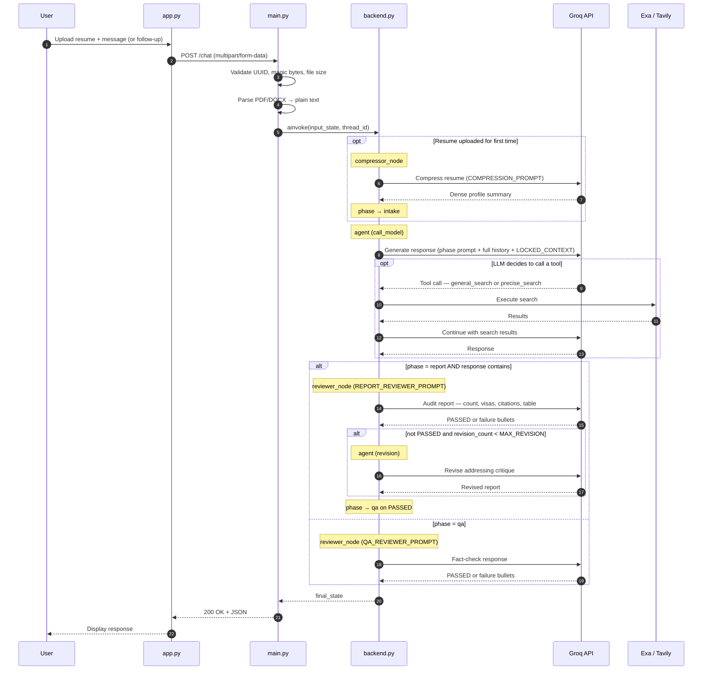

# Groovia — Immigroov's AI Career & Study Assistant

Groovia is an agentic AI backend that maps a user's resume to optimal global career or study destinations using real-time search data. Built with LangGraph (reflection pattern), served via FastAPI, and containerised with Docker.

The Streamlit frontend (`app.py`) is a test UI only — it communicates with the backend exclusively through the REST API.

---

## How It Works

The agent runs a **phase-based conversation** across four stages:

| Phase | Trigger | What happens |
|---|---|---|
| `no_resume` | Session start (no resume) | Answers general questions; asks user to upload resume |
| `intake` | Resume uploaded | Summarises profile; asks "Work or Study?" |
| `report` | Work/Study selected | Asks preferences, then generates the N-country report with real-time search |
| `qa` | Report approved | Answers follow-up questions with citations |

Within the `report` phase, a **reflection loop** runs automatically: a reviewer LLM audits the draft against a quality checklist (country count, visa names, citations, table). If it fails, the agent revises up to `MAX_REVISION` times before the response is returned.

---

## Sequence Diagram



---

## Project Structure

```
├── main.py             # FastAPI server — request handling, file parsing, session routing
├── backend.py          # LangGraph graph — nodes, phase transitions, reflection loop
├── prompts.py          # All LLM prompt templates (one per phase + reviewer + compressor)
├── utils.py            # Tool definitions (general_search, precise_search) and file parsers
├── config.py           # Environment variables and tunable parameters
├── schema.py           # Pydantic response model
├── app.py              # Streamlit test frontend (not included in Docker image)
├── Dockerfile
├── docker-compose.yaml # Local full-stack dev (API + UI)
├── .env                # Not committed — copy .env.example and fill in values
└── .env.example        # Template showing all required and optional variables
```

---

## API

### `POST /chat`

Accepts a user message and optional resume file. Maintains conversation state across turns using `thread_id`.

**Form fields**

| Field | Type | Required | Description |
|---|---|---|---|
| `message` | string | Yes | User's message |
| `thread_id` | string (UUID) | Yes | Persistent session identifier |
| `file` | file | No | PDF or DOCX resume (max 5MB) |

**Response**

```json
{
  "status": "success",
  "response": "...",
  "thread_id": "uuid"
}
```

**Error codes**

| Code | Reason |
|---|---|
| 400 | Invalid `thread_id` format |
| 413 | File exceeds 5MB |
| 415 | Unsupported or mismatched file type |
| 504 | Agent timed out (> 120s) |
| 500 | Internal agent error |

### `GET /health`

Returns `{"status": "ok"}`. Used by Docker and Render for readiness checks.

---

## Environment Variables

Copy `.env.example` to `.env` and fill in the required values:

```
# Required
GROQ_API_KEY=
TAVILY_API_KEY=
EXA_API_KEY=

# Optional — override default models
MAIN_MODEL_NAME=llama-3.3-70b-versatile
REVIEW_MODEL_NAME=llama-3.1-8b-instant

# Optional — server config
PORT=8000
CORS_ORIGINS=http://localhost:8501
```

On Render or Streamlit Cloud, set these in the platform dashboard — no `.env` file is used in production.

---

## Running Locally

**Backend only:**

```bash
pip install -r requirements.txt
uvicorn main:api --host 0.0.0.0 --port 8000 --reload
```

**Backend + frontend together (Docker):**

```bash
docker compose up --build
```

API at `http://localhost:8000` · UI at `http://localhost:8501`

---

## Configuration

All tunable parameters are in `config.py`:

| Parameter | Description |
|---|---|
| `MAIN_MODEL_NAME` | Primary agent model — overridable via env var |
| `REVIEW_MODEL_NAME` | Compressor and reviewer model — overridable via env var |
| `NUM_COUNTRIES` | Number of countries in the report |
| `MAX_REVISION` | Max reviewer rejection cycles before the response is returned as-is |
| `TEMPERATURE` | LLM temperature |
| `PORT` | Server port — reads `$PORT` env var first, falls back to the value in config |

Adjust values directly in `config.py`.

---

## Deployment (Render)

1. Push the repo to GitHub.
2. Create a new **Web Service** on Render and connect the repo.
3. Set runtime to **Docker** — Render builds from the `Dockerfile` automatically.
4. Add environment variables in the Render dashboard (`GROQ_API_KEY`, `TAVILY_API_KEY`, `EXA_API_KEY`, and `CORS_ORIGINS` with your frontend URL).
5. The `/health` endpoint serves as the health check URL.

> **Note:** Session state is held in-memory (`MemorySaver`). A container restart clears all active sessions. A persistent checkpointer (Redis or Postgres) is planned.
